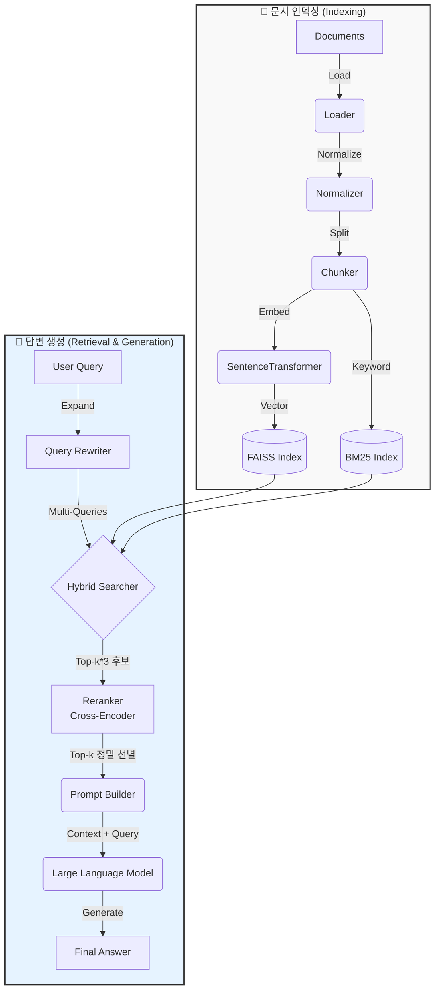

# Terminal RAG

터미널 기반의 로컬 RAG (Retrieval-Augmented Generation) 시스템입니다.
Python으로 구현되었으며, 로컬 임베딩/검색과 Google Gemini API를 활용한 답변 생성을 지원합니다.

## ✨ 주요 기능

- **문서 수집 (Ingestion)**
  - `.txt`, `.md`, `.pdf` 파일 지원
  - 디렉토리 재귀 탐색 및 자동 로드
  - 한국어/영어 언어 감지 및 텍스트 정규화
  - **증분 인덱싱**: 파일 해시 기반으로 변경된 문서만 재인덱싱

- **청킹 (Chunking)**
  - 문맥 유지를 위한 문장/문단 단위 분할
  - **Markdown 구조 인식**: 헤더(#) 기반 계층적 분할로 문맥 보존

- **임베딩 & 인덱싱 (Embedding & Indexing)**
  - **SentenceTransformers**: `paraphrase-multilingual-MiniLM-L12-v2` (다국어/한국어 지원, 로컬 실행)
  - **FAISS**: 고성능 벡터 유사도 검색 인덱스

- **검색 (Retrieval)**
  - **하이브리드 검색**: BM25 (키워드) + Vector (의미)
  - **Query Rewriting**: LLM을 활용한 질문 확장 및 최적화 (`--expand`)
  - **2단계 Reranking**: Cross-Encoder(`BAAI/bge-reranker-v2-m3`)로 검색 결과 재정렬
  - **한국어 형태소 분석**: `kiwipiepy`를 활용한 정확한 명사/용언 추출
  - 가중치 합산 (Weighted Sum) 및 Min-Max 정규화 기반 랭킹

- **답변 생성 (Generation)**
  - **Google Gemini API**: `gemini-1.5-flash` 모델 연동 (무료 티어 활용)
  - 근거 기반(Context-aware) 프롬프트 엔지니어링 (출처 인용 강제)

- **CLI 인터페이스**
  - `typer` 및 `rich` 기반의 직관적인 TUI (Spinner, Markdown 출력)

## 🏗️ 시스템 아키텍처



## 🛠️ 기술 스택

| 분류 | 기술 | 비고 |
|------|------|------|
| **언어** | Python 3.12+ | |
| **패키지 관리** | `uv` | Rust 기반 고속 패키지 매니저 |
| **CLI** | `typer`, `rich` | 커맨드라인 인터페이스 및 UI |
| **설정/검증** | `pydantic`, `pyyaml` | 환경변수 및 YAML 설정 관리 |
| **로깅** | `structlog` | JSON 구조화 로깅 및 민감정보 마스킹 |
| **임베딩** | `sentence-transformers` | 로컬 임베딩 모델 실행 |
| **벡터 DB** | `faiss-cpu`, `qdrant-client` | 벡터 검색 (로컬 FAISS / Qdrant 서버) |
| **키워드 검색** | `rank_bm25`, `kiwipiepy` | BM25 알고리즘 및 한국어 형태소 분석 |
| **Reranker** | `sentence-transformers` | Cross-Encoder 기반 2차 재정렬 |
| **LLM** | `google-generativeai` | Google Gemini API 클라이언트 |

## 🚀 시작하기

### 1. 설치

```bash
# Repository 클론
git clone https://github.com/your-username/terminal-rag.git
cd terminal-rag

# 의존성 설치 (uv 필요)
uv sync
```

### 2. 환경 설정

`.env` 파일을 생성하고 Google API 키를 설정합니다. ([키 발급 받기](https://aistudio.google.com/))

```bash
# .env 파일 생성
echo "GOOGLE_API_KEY=your_api_key_here" > .env
```

### 3. 사용 방법

CLI 엔트리포인트는 `cli.main` 모듈입니다.

#### 문서 인덱싱 (`rag index`)

지정된 경로의 문서를 벡터 인덱스로 변환하여 저장합니다.

```bash
# data/docs 폴더의 모든 문서 인덱싱
PYTHONPATH=src python -m cli.main index ./data/docs

# 인덱스 초기화 후 다시 생성
PYTHONPATH=src python -m cli.main index ./data/docs --reset
```

#### 질문하기 (`rag ask`)

인덱스된 문서를 바탕으로 AI가 답변합니다.

```bash
PYTHONPATH=src python -m cli.main ask "attention 이란게 뭐야?"

# 상세 로그 및 검색된 원문 컨텍스트 확인
PYTHONPATH=src python -m cli.main ask "BM25가 뭐야?" --verbose --show-context
```

#### Reranking으로 검색 품질 향상 (`--rerank`)

Cross-Encoder 기반 Reranker를 사용하여 검색 결과를 재정렬합니다.
1차 검색(Bi-Encoder)보다 정확한 관련성 평가가 가능합니다.

```bash
# Reranker 사용 (첫 실행 시 모델 다운로드 ~1.2GB)
PYTHONPATH=src python -m cli.main ask "Scaled Dot-Product Attention이 뭐야?" --rerank

# Reranker + 컨텍스트 확인
PYTHONPATH=src python -m cli.main ask "self-attention이란?" --rerank --show-context
```

> **Note**: Reranker는 `BAAI/bge-reranker-v2-m3` 모델을 사용하며, 한국어를 포함한 100+ 언어를 지원합니다.

#### Query Rewriting으로 검색 범위 확장 (`--expand`)

LLM을 사용하여 모호한 질문을 구체화하거나, 다양한 관점의 질문으로 확장하여 검색합니다.

```bash
# Query Rewriting 사용 (질문 변형 3개 생성)
PYTHONPATH=src python -m cli.main ask "BN이 뭐야?" --expand --show-context

# 최적 조합: Query Rewriting + Reranking (가장 강력한 검색)
PYTHONPATH=src python -m cli.main ask "attention 메커니즘의 원리는?" --expand --rerank
```

> **Note**: `--expand` 옵션 사용 시 LLM 호출 횟수가 증가하여 API 비용이 추가로 발생할 수 있습니다.

#### Local LLM 사용 (`--provider`)

Gemini API 대신 로컬 Ollama 모델을 사용할 수 있습니다.

**전제 조건:**
1. Ollama 설치 및 서버 실행 (`ollama serve`)
2. 모델 다운로드 (`ollama pull llama3`)

```bash
# Ollama로 질문하기
PYTHONPATH=src python -m cli.main ask "Attention이 뭐야?" --provider ollama

# Ollama + Query Rewriting (로컬 LLM이 쿼리 확장 수행)
PYTHONPATH=src python -m cli.main ask "BN 설명해줘" --provider ollama --expand
```

> **Note**: `--provider` 옵션은 즉시 Provider를 전환하며, Query Rewriting 등 내부적으로 LLM을 사용하는 모든 기능에 적용됩니다.

#### 검색 결과 확인 (`rag search`)

LLM 답변 생성 없이, 검색된 청크(Chunk)를 직접 확인합니다. (디버깅용)

```bash
PYTHONPATH=src python -m cli.main search "청킹 전략" --top-k 5
```

## 💻 CLI 명령어 상세 가이드

이 프로젝트는 다양한 CLI 옵션을 제공합니다. 각 기능의 조합으로 강력한 검색과 답변 생성이 가능합니다.

### 자주 사용하는 옵션 조합

| 시나리오 | 명령어 옵션 | 설명 |
|----------|-------------|------|
| **기본 (빠름)** | `rag ask "질문"` | Gemini API 사용, 기본 검색 |
| **정확도 향상** | `rag ask "질문" --rerank` | Reranker로 검색 결과 정밀 재정렬 |
| **범위 확장** | `rag ask "질문" --expand` | Query Rewriting으로 질문 변형 및 확장 검색 |
| **최고 성능** | `rag ask "질문" --expand --rerank` | 확장 검색 + 정밀 재정렬 (가장 강력함) |
| **로컬 LLM** | `rag ask "질문" --provider ollama` | 외부 API 없이 로컬 모델 사용 |
| **디버깅** | `rag ask "질문" --verbose --show-context` | 상세 로그 및 참고한 문서 청크 표시 |

### 상세 옵션 설명

- `--provider` (`-p`): LLM 공급자 선택 (`gemini` | `ollama`)
  - 기본값: `gemini` (또는 config 설정)
- `--expand` (`-e`): Query Rewriting 활성화
  - 질문을 3가지 다른 표현으로 확장하여 검색 범위를 넓힘
- `--rerank` (`-r`): Cross-Encoder Reranker 활성화
  - 1차 검색된 15개 후보를 정밀 재채점하여 상위 5개 선별
- `--top-k` (`-k`): 최종 답변 생성에 사용할 문서 청크 개수 (기본: 5)
- `--show-context` (`-s`): LLM이 답변에 참고한 문서 청크 내용을 출력
- `--verbose` (`-v`): 내부 로직(검색 점수, 토큰 수 등) 상세 로그 출력

### 환경 변수 설정 (.env)

로컬이 아닌 **원격 서버의 Ollama**를 사용하거나, 포트를 변경해야 할 경우 `.env` 파일에 설정을 추가하세요.

```bash
# .env 파일 예시
GOOGLE_API_KEY=your_key...

# Ollama 설정 (선택사항)
OLLAMA_BASE_URL=http://192.168.1.100:11434
OLLAMA_MODEL=llama3:8b
```

설정 후 실행하면 자동으로 해당 환경변수 값을 사용합니다.

```bash
PYTHONPATH=src python -m cli.main ask "원격 서버의 모델이 답변합니다" --provider ollama
```

---

## 📁 프로젝트 구조

```
terminal-rag/
├── cli/                 # CLI 명령어 구현 (typer)
├── configs/             # 기본 설정 파일 (default.yaml)
├── data/                # 데이터 저장소 (인덱스 등)
├── src/
│   └── rag/
│       ├── chunking/    # 텍스트 분할 로직
│       ├── embedding/   # 임베딩 및 벡터 저장소
│       ├── generation/  # LLM 연동 및 프롬프트
│       ├── ingestion/   # 문서 로딩 및 정규화
│       ├── retrieval/   # 검색 엔진 (Hybrid)
│       ├── config.py    # 설정 관리
│       └── logger.py    # 로깅 모듈
└── tests/               # 단위 및 통합 테스트
```

## 📸 실행 예시

### 1. 기본 질문 (`rag ask`)

```bash
$ PYTHONPATH=src python -m cli.main ask "RAG의 장점이 뭐야?"

Thinking...

Answer:
RAG의 주요 장점은 다음과 같습니다 [1]:
1. 최신성: 모델 재학습 없이 외부 데이터를 통해 최신 정보를 반영할 수 있습니다.
2. 정확성: 근거(Source)를 기반으로 답변하므로 환각(Hallucination) 현상이 줄어듭니다.
3. 보안: 민감한 데이터를 모델 학습에 사용하지 않고 안전하게 활용할 수 있습니다.
```

### 2. 상세 모드 (`--verbose`, `--show-context`)

검색 과정(로그)과 답변의 근거가 된 **원문 컨텍스트(Chunk)**를 함께 확인합니다.

```bash
$ PYTHONPATH=src python -m cli.main ask "Attention이 뭐야?" --verbose --show-context

... (로그 생략) ...

Answer:
제공된 문서에서 'Attention'이 무엇인지에 대한 직접적인 정의를 찾을 수 없습니다. 다만, Multi-Head Attention 등 관련 개념이 검색되었습니다. [1], [2]

References:
╭────────────────────────── [1] transformer_guide.md (Score: 0.6501) ──────────────────────────╮
│ ### 3.2 Multi-Head Attention                                                                 │
│ 단일 attention은 하나의 관계 공간에서만 상호작용을 모델링합니다. ...                         │
╰──────────────────────────────────────────────────────────────────────────────────────────────╯
╭────────────────────────── [2] rag_concept.md (Score: 0.4934) ────────────────────────────────╮
│ ### 11.2 Attention은 왜 RAG에 중요해졌나                                                     │
│ - 생성 모델이 문맥을 소비할 때, self-attention이 컨텍스트 내 근거를 연결합니다.              │
╰──────────────────────────────────────────────────────────────────────────────────────────────╯
```

## 🧪 테스트 실행

```bash
uv run pytest
```
