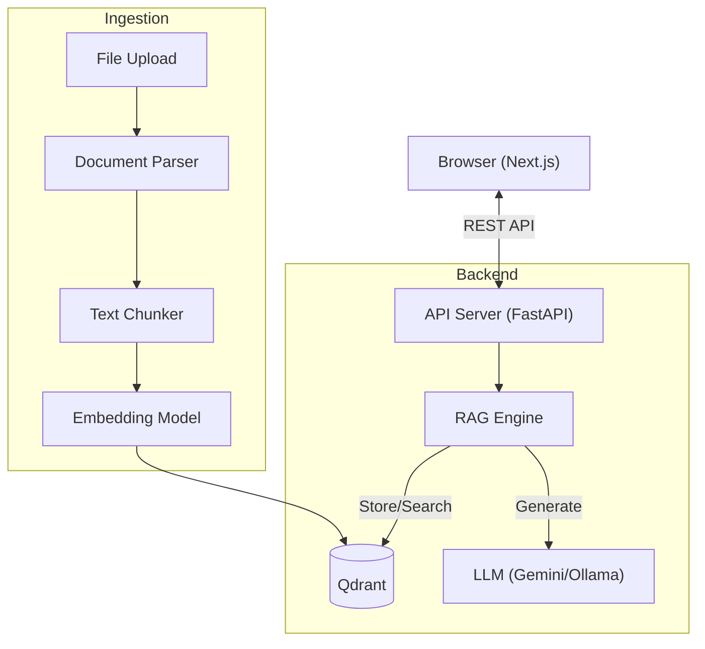

# Terminal RAG (Web Interface) 🚀

터미널 감성을 담은 **Full-Stack RAG (Retrieval-Augmented Generation)** 웹 애플리케이션입니다.
Python(FastAPI) 백엔드와 Next.js 프론트엔드로 구성되어 있으며, 로컬 환경에서 안전하고 강력한 문서 검색 및 질문 답변 기능을 제공합니다.


*(UI 스크린샷이 있다면 여기에 추가)*

## ✨ 주요 기능

- **웹 기반 인터페이스**: 터미널 스타일의 모던하고 직관적인 Web UI
- **문서 관리**:
  - Drag & Drop 파일 업로드 (`.txt`, `.md`, `.pdf` 지원)
  - 자동 파싱 및 벡터 인덱싱
  - 문서별 관리 및 삭제 기능
- **고급 검색 & 채팅**:
  - **전체 문서 채팅**: 업로드된 모든 문서를 대상으로 질문
  - **문서 내 채팅 (Document Scope)**: 특정 문서 안에서만 질문-답변
  - **히스토리 저장**: 대화 내용 자동 저장 및 조회
- **RAG 엔진**:
  - **Hybrid Search**: BM25 (키워드) + Vector (의미) 검색 결합
  - **Reranking**: Cross-Encoder를 사용한 검색 결과 정밀 재정렬
  - **Query Rewriting**: LLM을 활용한 질문 확장 및 최적화
- **유연한 모델 지원**:
  - **Cloud**: Google Gemini Pro/Flash
  - **Local**: Ollama (Llama 3, Mistral 등) 연동 가능

## 🏗️ 시스템 아키텍처



## 🛠️ 기술 스택

### Frontend
- **Framework**: Next.js 14 (App Router)
- **Language**: TypeScript
- **Styling**: TailwindCSS
- **State Management**: Zustand (Global Store)
- **UI Components**: Lucide React

### Backend
- **Framework**: FastAPI (Python 3.12+)
- **WSGI/ASGI**: Uvicorn
- **Package Manager**: `uv` (Rust based)

### AI & Infastructure
- **Vector DB**: Qdrant (Docker)
- **Embedding**: SentenceTransformers (`paraphrase-multilingual-MiniLM-L12-v2`)
- **LLM**: Google Gemini API / Ollama
- **Reranker**: `BAAI/bge-reranker-v2-m3`
- **Morphology**: KiwiPiePy (한국어 형태소 분석)

---

## 🚀 시작하기 (Getting Started)

### 0. 사전 준비 (Prerequisites)
- **Docker**: Qdrant 실행을 위해 필요
- **Node.js**: 18.0.0 이상
- **Python**: 3.12 이상
- **uv**: Python 패키지 매니저 (`pip install uv`)

### 1. 프로젝트 클론 & 환경 변수 설정
```bash
git clone https://github.com/okdoittttt/rag.git
cd rag

# 백엔드 환경변수 설정
echo "GOOGLE_API_KEY=your_gemini_api_key" > .env
# Qdrant 설정 (로컬 실행)
echo "QDRANT_HOST=localhost" >> .env
echo "QDRANT_PORT=6333" >> .env
```

### 2. 인프라 실행 (Vector DB)
Docker를 사용하여 Qdrant 벡터 데이터베이스를 실행합니다.
```bash
# Docker 컨테이너 실행
docker run -d --name qdrant \
    -p 6333:6333 \
    -v $(pwd)/data/qdrant_storage:/qdrant/storage \
    qdrant/qdrant
```

### 3. 백엔드 실행 (API Server)
FastAPI 서버를 실행합니다.
```bash
# 의존성 설치 및 가상환경 동기화
uv sync

# 서버 실행 (포트 8000)
PYTHONPATH=src uv run uvicorn api.main:app --host 127.0.0.1 --port 8000 --reload
```

### 4. 프론트엔드 실행 (Web Client)
새 터미널을 열고 Next.js 클라이언트를 실행합니다.
```bash
cd ui

# 의존성 설치
npm install

# 개발 서버 실행 (포트 3000)
npm run dev
```

### 5. 접속
브라우저에서 `http://localhost:3000` 으로 접속하여 사용합니다.

---

## 🧪 테스트 및 검증

### 백엔드 테스트
```bash
# 단위/통합 테스트 실행
uv run pytest
```

### API 문서
서버가 실행 중일 때 `http://localhost:8000/docs` 에서 Swagger UI를 통해 API를 직접 테스트할 수 있습니다.

