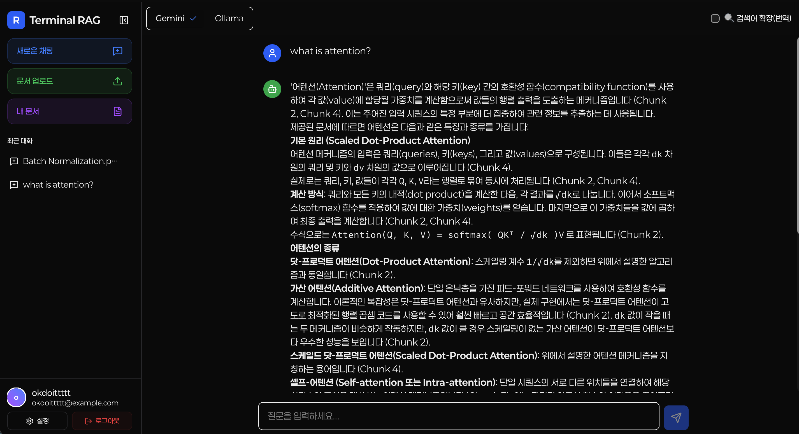
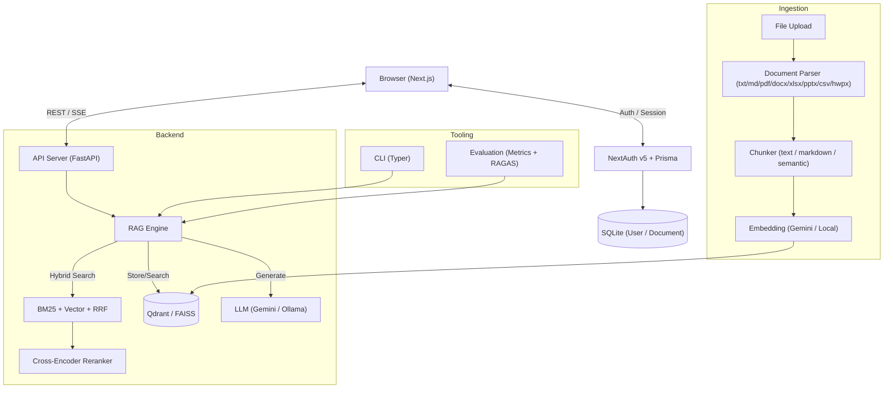

# Terminal RAG (Web Interface) 🚀

터미널 감성을 담은 **Full-Stack RAG (Retrieval-Augmented Generation)** 웹 애플리케이션입니다.
Python(FastAPI) 백엔드와 Next.js 프론트엔드로 구성되어 있으며, 로컬 환경에서 안전하고 강력한 문서 검색 및 질문 답변 기능을 제공합니다.

사용자 인증, 사용자별 문서 격리, 하이브리드 검색 + Cross-Encoder 재정렬, 문서 요약 모드, 스트리밍 답변, 그리고 검색/생성 품질을 정량적으로 측정하는 평가 파이프라인까지 갖춘 풀스택 시스템입니다.




## ✨ 주요 기능

- **웹 기반 인터페이스**: 터미널 스타일의 모던하고 직관적인 Web UI
- **사용자 인증 & 격리**:
  - 이메일/비밀번호 기반 회원가입·로그인 (NextAuth v5 + JWT)
  - 사용자별(`user_id`) 문서·인덱스 격리로 멀티 테넌트 지원
- **문서 관리**:
  - Drag & Drop 파일 업로드 (`.txt`, `.md`, `.pdf`, `.docx`, `.xlsx`, `.pptx`, `.csv`, `.hwpx` 지원)
    - 지원 확장자는 파서 레지스트리(`src/rag/ingestion/parsers`)를 단일 소스로 관리하며,
      `GET /config/supported-extensions`로 조회됩니다. 새 파서 추가 시 UI 허용 형식도 자동 반영.
  - 자동 파싱 → 청킹 → 벡터 인덱싱
  - 문서별 목록 관리, 검색, 개별/일괄 삭제 (인덱스 동기 정리)
  - 증분 인덱싱: 파일 해시 추적으로 변경된 파일만 재인덱싱 (CLI)
- **고급 검색 & 채팅**:
  - **전체 문서 채팅**: 업로드된 모든 문서를 대상으로 질문
  - **문서 내 채팅 (Document Scope)**: 특정 문서 안에서만 질문-답변
  - **문서 요약 모드 (`doc_mode`)**: "요약해줘"와 같은 요약 의도를 감지하면
    top-k 검색 대신 해당 문서의 **전체 청크**를 순서대로 LLM에 투입
  - **스트리밍 답변**: SSE(Server-Sent Events) 기반 토큰 단위 실시간 출력
  - **히스토리 저장**: 대화 내용 자동 저장 및 조회
- **RAG 엔진**:
  - **Hybrid Search**: BM25(키워드) + Vector(의미) 검색을 RRF 또는 가중합으로 결합
  - **Reranking**: Cross-Encoder(`bge-reranker-v2-m3`) 기반 정밀 재정렬 (**기본 ON**)
  - **Query Expansion**: LLM으로 질문을 여러 검색 변형으로 재작성 (교차 언어 한↔영 포함)
  - **한국어 형태소 분석**: Kiwi 기반 토크나이징으로 한국어 키워드 검색 품질 향상
  - **다양한 청킹 전략**: 일반 텍스트 / Markdown 구조 보존 / Semantic(문장 임베딩 유사도)
- **유연한 모델 지원**:
  - **Cloud**: Google Gemini (기본 `gemini-2.5-flash`)
  - **Local**: Ollama (Llama 3, Mistral 등) 연동 가능
  - **Embedding**: Google Gemini Embedding 2 (`gemini-embedding-2`, **기본**) / 로컬 SentenceTransformers 전환 가능 (`embedding.provider`)
  - **Vector Store**: Qdrant(기본) / FAISS 선택
- **CLI 도구**: 인덱싱·검색·질의를 터미널에서 직접 수행 (`rag` / `python main.py`)
- **평가 파이프라인**: 검색 메트릭(Recall@k, MRR 등) + RAGAS(LLM-as-judge) 정량 평가 및 리포트 생성

## 🏗️ 시스템 아키텍처


```mermaid
graph TD
    Client["Browser (Next.js)"] <-->|REST / SSE| API["API Server (FastAPI)"]
    Client <-->|Auth / Session| Auth["NextAuth v5 + Prisma"]
    Auth --> DB[("SQLite (User / Document)")]

    subgraph Backend
        API --> Engine["RAG Engine"]
        Engine -->|Hybrid Search| Retriever["BM25 + Vector + RRF"]
        Retriever --> Reranker["Cross-Encoder Reranker"]
        Engine -->|Store/Search| VectorDB[("Qdrant / FAISS")]
        Engine -->|Generate| LLM["LLM (Gemini / Ollama)"]
    end

    subgraph Ingestion
        Upload["File Upload"] --> Parser["Document Parser (txt/md/pdf/docx/xlsx/pptx/csv/hwpx)"]
        Parser --> Chunker["Chunker (text / markdown / semantic)"]
        Chunker --> Embedder["Embedding (Gemini / Local)"]
        Embedder --> VectorDB
    end

    subgraph Tooling
        CLI["CLI (Typer)"] --> Engine
        Evals["Evaluation (Metrics + RAGAS)"] --> Engine
    end
```

## 🛠️ 기술 스택

### Frontend
- **Framework**: Next.js 16 (App Router)
- **Language**: TypeScript 5.x / React 19
- **Styling**: TailwindCSS 4
- **State Management**: Zustand (Global Store)
- **Auth**: NextAuth v5 (Credentials Provider) + `@auth/prisma-adapter`
- **ORM / DB**: Prisma 5 + SQLite
- **UI Components**: Lucide React, react-markdown, next-themes

### Backend
- **Framework**: FastAPI (Python 3.12+)
- **ASGI Server**: Uvicorn
- **Package Manager**: `uv` (Rust based)
- **CLI**: Typer + Rich
- **Logging**: structlog (JSON 구조화 로깅)

### AI & Infrastructure
- **Vector DB**: Qdrant (Docker, 기본) / FAISS (옵션)
- **Embedding**: Google Gemini Embedding 2 (`gemini-embedding-2`, 3072-dim, **기본**) / 로컬 SentenceTransformers 선택 가능 (`embedding.provider` 설정으로 전환)
- **LLM**: Google Gemini API / Ollama
- **Reranker**: `BAAI/bge-reranker-v2-m3` (Cross-Encoder)
- **Keyword Search**: rank-bm25
- **Morphology**: KiwiPiePy (한국어 형태소 분석)
- **Evaluation**: RAGAS (faithfulness / answer_relevancy / context_precision / context_recall)

> 정확한 패키지/버전은 [pyproject.toml](pyproject.toml), [ui/package.json](ui/package.json)을 항상 우선 참조하세요.

---

## ⚡ Quick Start (Docker Compose)

모든 구성 요소(Qdrant, API, UI)를 Docker Compose로 한 번에 실행할 수 있습니다.
[compose.yaml](compose.yaml)은 다음 3개 서비스를 띄웁니다.

| 서비스 | 설명 | 포트 |
|--------|------|------|
| `qdrant` | 벡터 데이터베이스 | 6333 (REST), 6334 (gRPC) |
| `api` | FastAPI 백엔드 (RAG 엔진) | 8000 |
| `ui` | Next.js 프론트엔드 | 3000 |

```bash
# 1. 백엔드 환경 변수 설정 (Google Gemini API Key 등)
cp .env.example .env
vi .env
#   GOOGLE_API_KEY=...        # Gemini 사용 시
#   API_KEY=...               # API ↔ UI 간 인증 키 (production 필수)
#   OLLAMA_BASE_URL=...       # Ollama 사용 시 (옵션)

# 2. 프론트엔드 환경 변수 설정 (NextAuth)
cp ui/.env.example ui/.env       # 도커용
#   AUTH_SECRET=$(openssl rand -base64 32)  로 채우고
#   API_KEY 는 위 .env 의 값과 동일하게 맞춘다.

# 3. 서비스 실행
docker compose up -d --build
```

실행 후 브라우저에서 `http://localhost:3000`으로 접속하세요.
**최초 접속 시 회원가입(`/register`) → 로그인(`/login`)** 후 사용합니다.

> ℹ️ 운영(production) 배포 시 `compose.yaml`의 `APP_ENV=production` 주석을 해제하세요.
> `API_KEY`가 미설정 상태로 기동되면 API 미들웨어가 `RuntimeError`로 fail-fast 합니다.

---

## 🚀 수동 시작하기 (Manual Setup)

### 0. 사전 준비 (Prerequisites)
- **Docker**: Qdrant 실행을 위해 필요
- **Node.js**: 18.0.0 이상
- **Python**: 3.12 이상
- **uv**: Python 패키지 매니저 (`pip install uv`)

### 1. 프로젝트 클론 & 환경 변수 설정
```bash
git clone https://github.com/okdoittttt/rag.git
cd rag

# 백엔드 환경변수 설정
echo "GOOGLE_API_KEY=your_gemini_api_key" > .env
# Qdrant 설정 (로컬 실행)
echo "QDRANT_HOST=localhost" >> .env
echo "QDRANT_PORT=6333" >> .env
```

### 2. 인프라 실행 (Vector DB)
Docker를 사용하여 Qdrant 벡터 데이터베이스를 실행합니다.
```bash
# Docker 컨테이너 실행
docker run -d --name qdrant \
    -p 6333:6333 \
    -v $(pwd)/data/qdrant_storage:/qdrant/storage \
    qdrant/qdrant
```

### 3. 백엔드 실행 (API Server)
FastAPI 서버를 실행합니다.
```bash
# 의존성 설치 및 가상환경 동기화
uv sync

# 서버 실행 (포트 8000)
PYTHONPATH=src uv run uvicorn api.main:app --host 127.0.0.1 --port 8000 --reload
```

### 4. 프론트엔드 실행 (Web Client)
새 터미널을 열고 Next.js 클라이언트를 실행합니다.
```bash
cd ui

# 환경 변수 설정 (.env.local 은 .env 보다 우선 로드됨)
cp .env.example .env.local
#   AUTH_SECRET : openssl rand -base64 32 로 생성
#   API_KEY     : 루트 .env 의 값과 동일하게
#   API_URL     : 로컬 직접 실행 시 http://127.0.0.1:8000
#   UPLOAD_DIR  : 백엔드 허용 경로와 일치 (절대경로 권장, 예: <repo>/data/uploads)

# 의존성 설치
npm install

# DB(SQLite) 스키마 적용 (최초 1회)
npx prisma migrate deploy   # 또는 개발 환경: npx prisma migrate dev

# 개발 서버 실행 (포트 3000)
npm run dev
```

### 5. 접속
브라우저에서 `http://localhost:3000` 으로 접속하여 회원가입 후 사용합니다.

---

## 🖥️ CLI 사용법

웹 UI 없이 터미널에서 직접 인덱싱·검색·질의를 수행할 수 있습니다.
Typer 기반 CLI([cli/main.py](cli/main.py))는 `cli.main` 모듈로 실행합니다.

```bash
# 문서 인덱싱 (디렉터리/파일 경로)
PYTHONPATH=src uv run python -m cli.main index ./docs
PYTHONPATH=src uv run python -m cli.main index ./docs --reset   # 기존 인덱스 초기화 후 재인덱싱

# 검색 (LLM 호출 없이 관련 청크만 확인 — 디버깅용)
PYTHONPATH=src uv run python -m cli.main search "RAG 청킹 전략" --top-k 5

# 질의-응답 (검색 + LLM 생성)
PYTHONPATH=src uv run python -m cli.main ask "이 문서의 핵심 내용을 알려줘" \
    --rerank --expand --show-context --provider gemini
```

주요 옵션: `--top-k`, `--rerank`(재정렬), `--expand`(쿼리 확장),
`--show-context`(참조 청크 표시), `--provider`(gemini/ollama), `--verbose`.

---

## 🌐 주요 API 엔드포인트

| Method | Path | 설명 |
|--------|------|------|
| `POST` | `/ask` | 검색 + LLM 답변 생성 (참조 청크 포함) |
| `POST` | `/ask/stream` | SSE 스트리밍 답변 (참조 선전송 후 토큰 스트리밍) |
| `POST` | `/search` | LLM 없이 하이브리드 검색 결과만 반환 |
| `POST` | `/index` | 텍스트/파일 청킹 및 인덱싱 (동일 source 재인덱싱 시 기존 청크 정리) |
| `DELETE` | `/index/by-source` | `filename` + `user_id` 단위 인덱스 삭제 |
| `GET/POST` | `/config/system-prompt` | 시스템 프롬프트 조회/갱신 |

`/ask` 요청은 `doc_mode`, `source_filter`, `summarize_override`, `expand`, `rerank`,
`provider`, `user_id` 등으로 동작을 세밀하게 제어할 수 있습니다.
(스키마: [src/api/schemas.py](src/api/schemas.py))

> 인증: API는 `X-API-Key` 헤더 기반 인증을 사용합니다. `production` 환경에서는 `API_KEY`가 필수입니다.

---

## 🧪 테스트 및 평가

### 백엔드 테스트
```bash
# 단위/통합 테스트 실행
uv run pytest
```

### 평가 파이프라인 (Evaluation)
골든셋(JSONL)을 기반으로 검색·생성 품질을 정량 측정하고 Markdown 리포트를 생성합니다.
자세한 내용은 [docs/evaluation.md](docs/evaluation.md)를 참고하세요.

```bash
# 빠른 회귀 (검색 메트릭만: Recall@k, Precision@k, MRR, source_recall)
python -m evals.ragas_runner --golden evals/golden_set.jsonl --out evals/history/quick.csv

# Reranker A/B 비교
python -m evals.ragas_runner --out evals/history/baseline.csv
python -m evals.ragas_runner --rerank --out evals/history/with_rerank.csv
python -m evals.report --current evals/history/with_rerank.csv --baseline evals/history/baseline.csv

# 답변 생성 + RAGAS(LLM-as-judge) 전체 평가
python -m evals.ragas_runner --with-answer --with-ragas --out evals/history/full.csv
```

측정 지표: `recall@{1,3,5,10}`, `precision@5`, `mrr`, `source_recall`,
RAGAS의 `faithfulness` / `answer_relevancy` / `context_precision` / `context_recall`,
그리고 검색/생성 latency.

### API 문서
서버가 실행 중일 때 `http://localhost:8000/docs` 에서 Swagger UI를 통해 API를 직접 테스트할 수 있습니다.
