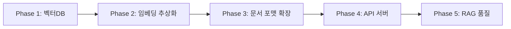

# Terminal RAG v2.0 로드맵

> v1.0.0에서 기본 RAG 파이프라인(Ingestion → Chunking → Embedding → Retrieval → Generation)을 완성했습니다.  
> 이제 **확장성**, **안정성**, **통합성**을 높이는 v2.0을 계획합니다.

---

## 📋 사용자 요구사항 (우선순위 정렬)

| 순위 | 항목 | 설명 | 난이도 |
|:---:|------|------|:------:|
| 1 | 🗄️ 벡터 DB 연동 | 휘발성 FAISS → 영속성 DB (Chroma, Qdrant 등) | ⭐⭐⭐ |
| 2 | 🔌 다중 임베딩 모델 | Provider 추상화 (SentenceTransformers, OpenAI, Cohere 등) | ⭐⭐⭐ |
| 3 | 📄 다양한 문서 포맷 | PDF, DOCX, HTML, 코드 파일 지원 | ⭐⭐ |
| 4 | 🌐 API 서버 구현 | FastAPI 기반 REST API (프론트엔드 연동용) | ⭐⭐ |
| 5 | 🎯 RAG 품질 개선 | Reranker, Query Rewriting, Hybrid Search 구현 완료 (조정 필요) | ⭐⭐⭐⭐ |

---

## 🔀 권장 작업 순서

### 이유

1. **벡터 DB 먼저**: 현재 FAISS 인덱스는 파일 기반으로 관리되어 동시 접근, 스케일링에 한계가 있습니다. DB 연동은 이후 모든 기능(API, 다중 사용자)의 기반이 됩니다.

2. **임베딩 추상화**: 벡터 DB 연동 후, 다양한 임베딩 모델을 쉽게 교체할 수 있도록 Provider 패턴을 적용합니다. 이 단계에서 OpenAI 임베딩도 지원 가능해집니다.

3. **문서 포맷 확장**: Ingestion 레이어에 파서를 추가하는 작업으로, 기존 아키텍처에 영향이 적어 언제든 진행 가능합니다.

4. **API 서버**: 벡터 DB + 임베딩 추상화가 완료되면, FastAPI로 HTTP 엔드포인트를 추가합니다. 프론트엔드 개발과 병행 가능합니다.

5. **RAG 품질**: 모든 인프라가 안정화된 후, Reranker, Query Expansion 등 고급 기법을 적용합니다.

---

## 📦 Phase별 상세 계획

### Phase 1: 벡터 DB 연동
**목표**: FAISS → Chroma/Qdrant 전환으로 영속성 확보

- [ ] 벡터 DB 선택 (Chroma vs Qdrant vs Milvus 비교)
- [ ] `VectorStore` 인터페이스 추상화 (`src/rag/embedding/store.py`)
- [ ] Chroma 어댑터 구현
- [ ] 마이그레이션 CLI (`rag migrate`)
- [ ] 기존 FAISS 인덱스 → Chroma 데이터 이전 스크립트

**예상 소요**: 3-5일

---

### Phase 2: 다중 임베딩 모델 지원
**목표**: Provider 패턴으로 임베딩 모델 교체 용이성 확보

- [ ] `EmbedderProvider` 프로토콜 정의
- [ ] `SentenceTransformerProvider` 구현 (현재 로직 리팩토링)
- [ ] `OpenAIProvider` 구현 (API 키 필요)
- [ ] `CohereProvider` 구현 (선택)
- [ ] 설정 파일에서 `embedding.provider` 필드 추가
- [ ] CLI에서 `--provider` 옵션 지원

**예상 소요**: 2-3일

---

### Phase 3: 다양한 문서 포맷 지원
**목표**: PDF, DOCX, HTML 등 다양한 포맷 인제스트

- [ ] PDF 파서 추가 (`pypdf` 또는 `pdfplumber`)
- [ ] DOCX 파서 추가 (`python-docx`)
- [ ] HTML 파서 추가 (`beautifulsoup4`)
- [ ] 코드 파일 파서 (`.py`, `.js`, `.ts` - AST 기반 청킹)
- [ ] `ingestion.supported_extensions` 자동 감지 개선
- [ ] CLI `--file-type` 옵션 추가

**예상 소요**: 3-4일

---

### Phase 4: API 서버 구현
**목표**: FastAPI 기반 REST API로 프론트엔드 연동

- [ ] FastAPI 프로젝트 구조 (`src/api/`)
- [ ] 엔드포인트 설계
  - `POST /index` - 문서 인덱싱
  - `POST /ask` - 질문 답변
  - `GET /search` - 검색만
  - `GET /health` - 상태 확인
- [ ] Pydantic 스키마 정의
- [ ] CORS 설정
- [ ] API 키 인증 (선택)
- [ ] Swagger 문서 자동 생성
- [ ] Docker Compose에 API 서비스 추가

**예상 소요**: 3-4일

---

### Phase 5: RAG 품질 개선
**목표**: 검색 정확도 및 답변 품질 향상

- [x] Cross-Encoder Reranker 도입 (`BAAI/bge-reranker-v2-m3`)
- [x] Query Rewriting (LLM 사용)
- [x] Hybrid Search 가중치 자동 튜닝 (RRF 알고리즘 도입)
- [ ] 청킹 전략 개선 (Semantic Chunking)
- [ ] Lost in the Middle 완화 (컨텍스트 순서 최적화)
- [ ] 평가 프레임워크 구축 (`eval/`)

**예상 소요**: 5-7일

---

## 💡 추가 제안 기능

사용자 요구사항 외에 다음 기능도 고려해볼 만합니다:

| 기능 | 설명 | 우선순위 |
|------|------|:--------:|
| **스트리밍 응답** | LLM 답변을 실시간으로 출력 (SSE/WebSocket) | 높음 |
| **캐싱 레이어** | 동일 쿼리/문서에 대한 임베딩 캐싱으로 비용 절감 | 중간 |
| **문서 버전 관리** | 같은 문서의 업데이트 시 diff 기반 재인덱싱 | 중간 |
| **Multi-tenant** | 사용자/프로젝트별 인덱스 분리 | API 이후 |
| **Observability** | 쿼리 로그, latency 대시보드, 에러 추적 | 중간 |
| **Evaluation Suite** | 자동화된 RAG 품질 테스트 (Recall, MRR, Faithfulness) | 높음 |
| **LLM Provider 추상화** | Gemini 외 OpenAI, Claude, Ollama 지원 | 중간 |

---

## 🛠️ 기술 스택 후보

| 영역 | 현재 | v2.0 후보 |
|------|------|----------|
| 벡터 DB | FAISS (로컬) | Chroma, Qdrant, Weaviate |
| 임베딩 | SentenceTransformers | + OpenAI, Cohere, Voyage |
| API | - | FastAPI |
| 문서 파싱 | 자체 구현 | LangChain Loaders, Unstructured |
| Reranker | - | CrossEncoder, Cohere Rerank |
| 캐싱 | - | Redis, diskcache |

---

## ⏱️ 예상 일정

| Phase | 기간 | 마일스톤 |
|-------|------|----------|
| Phase 1 | Week 1 | v1.1.0 - 벡터 DB 연동 |
| Phase 2 | Week 2 | v1.2.0 - 임베딩 추상화 |
| Phase 3 | Week 3 | v1.3.0 - 문서 포맷 확장 |
| Phase 4 | Week 4 | v1.4.0 - API 서버 |
| Phase 5 | Week 5-6 | v2.0.0 - RAG 품질 개선 |

---

## 📝 다음 단계

1. 이 로드맵을 검토하고 우선순위 조정
2. Phase 1 상세 설계 (벡터 DB 선택)
3. Issue/Task 생성 및 작업 시작

---

*최종 수정: 2026-01-17*
